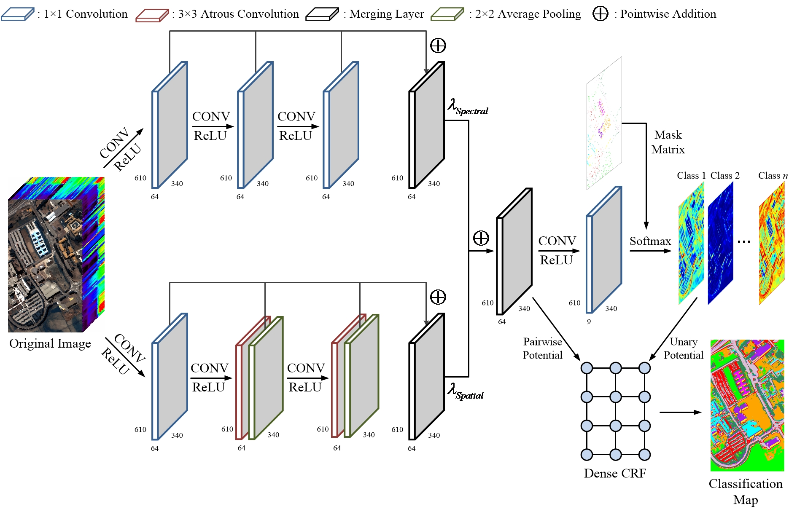

# Spectral-Spatial Fully Convolutional Networks for Hyperspectral Image Classification

Tensorflow implementation of our method for hyperspectral image classification.



## Paper
[Beyond the Patchwise Classification: Spectral-Spatial Fully Convolutional Networks for Hyperspectral Image Classification](https://ieeexplore.ieee.org/abstract/document/8737729/)

Please cite our papers if you find it useful for your research.

```
@article{ssfcn,
  title={Beyond the Patchwise Classification: Spectral-Spatial Fully Convolutional Networks for Hyperspectral Image Classification},
  author={Xu, Yonghao and Du, Bo and Zhang, Liangpei},
  journal={IEEE Transactions on Big Data},
  year={2019},
  publisher={IEEE}
}
```

## Installation
* Install `Tensorflow 1.13` with `Python 3.6`.

* Install `pydensecrf`.
  
* Clone this repo.
```
git clone https://github.com/YonghaoXu/SSFCN
```
## Dataset
* Download the [Pavia University image](http://www.ehu.eus/ccwintco/uploads/e/ee/PaviaU.mat) and the corresponding [annotations](http://www.ehu.eus/ccwintco/uploads/5/50/PaviaU_gt.mat). Put these files into the `DataSets` folder.

## Usage
* For Spectral Classification:
  - Run `SpeFCN.py`
* For Spatial Classification:
  - Run `SpaFCN.py`
* For Spectral-Spatial Classification:
  - Run `SSFCN.py`
